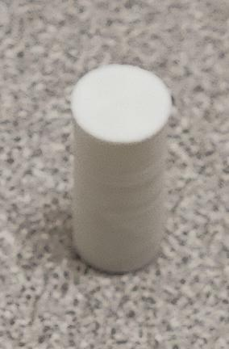

# Manual de ensamblaje: Eva 4.0

    

# Versions of the social robot Eva

Three versions of the social robot Eva were designed. The assembly demonstrated, as well as the images used in this manual, correspond to the most equipped version of the robot.

| Nombre | foto | Descripción |
| :--- | :---: | :--- |
| Eva básico |  | La versión básica del robot social Eva cuenta con tres capacidades: <ul><li>Interacción verbal: a través de un arreglo de micrófonos (Matrix Voice) y una bocina.</li><li>Ojos: a través de una pantalla de 5,5".</li><li>Movimiento de la cabeza: a través del uso de dos motores Dynamixel AX-12A ([Hard#10](#Hard#10)).</li></ul> |
| Eva con cámara |  | La versión con cámara del robot social Eva hereda las capacidades de la versión básica. Las nuevas capacidades de esta versión son: <ul><li>Visión: haciendo uso de una cámara Intel RealSense Depth Camera D435i ([Hard#4](#Hard#4))</li></ul> |
| Eva con cámara y movimiento |  | La versión con cámara y movimiento del robot social Eva hereda las capacidades de la versión con cámara. Las nuevas capacidades de esta versión son: <ul><li>Movimiento: haciendo uso de dos nuevos motores y ruedas.</li></ul> |

# Eva básico

<table border="0">
 <tr>
    <td>
        <ul>
            <li>Componentes
                <ul>
                    <li>Imprimibles
                        <ul>
                            <li><a href="#Imp#1">Imp#1</a></li>
                            <li><a href="#Imp#3">Imp#3</a></li>
                            <li><a href="#Imp#5">Imp#5</a></li>
                            <li><a href="#Imp#7">Imp#7</a></li>
                            <li><a href="#Imp#9">Imp#9</a></li>
                            <li><a href="#Imp#10">Imp#10</a></li>
                            <li><a href="#Imp#11">Imp#11</a></li>
                            <li><a href="#Imp#12">Imp#12</a></li>
                            <li><a href="#Imp#13">Imp#13</a></li>
                            <li><a href="#Imp#14">Imp#14</a></li>
                        </ul>
                    </li>
                </ul>
                <ul>
                    <li>Electrónicos
                        <ul>
                            <li><a href="#Hard#1">Hard#1</a></li>
                            <li><a href="#Hard#2">Hard#2</a></li>
                            <li><a href="#Hard#17">Hard#17</a></li>
                            <li><a href="#Hard#8">Hard#8</a></li>
                            <li><a href="#Hard#10">Hard#10</a></li>
                            <li><a href="#Hard#11">Hard#11</a></li>
                            <li><a href="#Hard#13">Hard#13</a></li>
                            <li><a href="#Hard#14">Hard#14</a></li>
                            <li><a href="#Hard#15">Hard#15</a></li>
                        </ul>
                    </li>
                </ul>
            </li>
        </ul>
    </td>
    <td>
        <ul>
            <li>Ensamblaje
                <ul>
                    <li><a href="#armando-el-cuello">Armando cuello</a>
                        <ul>
                            <li><a href="#versión-estática">Versión Estática</a></li>
                            <li><a href="#raspberry-y-matrix-voice">Raspberry y Matrix Voice</a></li>
                        </ul>
                    </li>
                    <li><a href="#base-del-robot">Base del robot</a>
                        <ul>
                            <li><a href="#estático">Estático</a></li>
                        </ul>
                    </li>
                    <li><a href="#ensamblaje-del-interior">Ensamblaje del Interior</a></li>
                    <li><a href="#ensamblaje-de-la-cabeza">Ensamblaje de la cabeza</a>
                        <ul>
                            <li><a href="#sin-cámara">Sin cámara</a></li>
                            <li><a href="#pantalla">Pantalla</a></li>
                        </ul>
                    </li>
                    <li><a href="#ensamblaje-final">Ensamblaje final</a></li>
                </ul>
            </li>
        </ul>
    </td>
    <td></td>
 </tr>
</table>

# Eva con cámara

<table border="0">
 <tr>
    <td>
        <ul>
            <li>Componentes
                <ul>
                    <li>Imprimibles
                        <ul>
                            <li><a href="#Imp#2">Imp#2</a></li>
                            <li><a href="#Imp#3">Imp#3</a></li>
                            <li><a href="#Imp#4">Imp#4</a></li>
                            <li><a href="#Imp#5">Imp#5</a></li>
                            <li><a href="#Imp#7">Imp#7</a></li>
                            <li><a href="#Imp#9">Imp#9</a></li>
                            <li><a href="#Imp#10">Imp#10</a></li>
                            <li><a href="#Imp#11">Imp#11</a></li>
                            <li><a href="#Imp#12">Imp#12</a></li>
                            <li><a href="#Imp#13">Imp#13</a></li>
                            <li><a href="#Imp#14">Imp#14</a></li>
                        </ul>
                    </li>
                </ul>
                <ul>
                    <li>Electrónicos
                        <ul>
                            <li><a href="#Hard#1">Hard#1</a></li>
                            <li><a href="#Hard#2">Hard#2</a></li>
                            <li><a href="#Hard#17">Hard#17</a></li>
                            <li><a href="#Hard#4">Hard#4</a></li>
                            <li><a href="#Hard#8">Hard#8</a></li>
                            <li><a href="#Hard#10">Hard#10</a></li>
                            <li><a href="#Hard#11">Hard#11</a></li>
                            <li><a href="#Hard#13">Hard#13</a></li>
                            <li><a href="#Hard#14">Hard#14</a></li>
                            <li><a href="#Hard#15">Hard#15</a></li>
                        </ul>
                    </li>
                </ul>
            </li>
        </ul>
    </td>
    <td>
        <ul>
            <li>Ensamblaje
                <ul>
                    <li><a href="#armando-el-cuello">Armando cuello</a>
                        <ul>
                            <li><a href="#versión-estática">Versión Estática</a></li>
                            <li><a href="#raspberry-y-matrix-voice">Raspberry y Matrix Voice</a></li>
                        </ul>
                    </li>
                    <li><a href="#base-del-robot">Base del robot</a>
                        <ul>
                            <li><a href="#estático">Estático</a></li>
                        </ul>
                    </li>
                    <li><a href="#ensamblaje-del-interior">Ensamblaje del Interior</a></li>
                    <li><a href="#ensamblaje-de-la-cabeza">Ensamblaje de la cabeza</a>
                        <ul>
                            <li><a href="#con-cámara">Con cámara</a>
                                <ul>
                                    <li><a href="#cámara">Cámara</a></li>
                                </ul>
                            </li>
                            <li><a href="#pantalla">Pantalla</a></li>
                        </ul>
                    </li>
                    <li><a href="#ensamblaje-final">Ensamblaje final</a></li>
                </ul>
            </li>
        </ul>
    </td>
    <td></td>
 </tr>
</table>

# Eva con cámara y movimiento

<table border="0">
 <tr>
    <td>
        <ul>
            <li>Componentes
                <ul>
                    <li>Imprimibles
                        <ul>
                            <li><a href="#Imp#2">Imp#2</a></li>
                            <li><a href="#Imp#3">Imp#3</a></li>
                            <li><a href="#Imp#6">Imp#4</a></li>
                            <li><a href="#Imp#8">Imp#5</a></li>
                            <li><a href="#Imp#9">Imp#7</a></li>
                            <li><a href="#Imp#10">Imp#9</a></li>
                            <li><a href="#Imp#11">Imp#10</a></li>
                            <li><a href="#Imp#12">Imp#11</a></li>
                            <li><a href="#Imp#13">Imp#12</a></li>
                            <li><a href="#Imp#14">Imp#13</a></li>
                        </ul>
                    </li>
                </ul>
                <ul>
                    <li>Electrónicos
                        <ul>
                            <li><a href="#Hard#1">Hard#1</a></li>
                            <li><a href="#Hard#2">Hard#2</a></li>
                            <li><a href="#Hard#3">Hard#3</a></li>
                            <li><a href="#Hard#4">Hard#4</a></li>
                            <li><a href="#Hard#5">Hard#5</a></li>
                            <li><a href="#Hard#6">Hard#6</a></li>
                            <li><a href="#Hard#7">Hard#7</a></li>
                            <li><a href="#Hard#8">Hard#8</a></li>
                            <li><a href="#Hard#9">Hard#9</a></li>
                            <li><a href="#Hard#10">Hard#10</a></li>
                            <li><a href="#Hard#11">Hard#11</a></li>
                            <li><a href="#Hard#12">Hard#12</a></li>
                            <li><a href="#Hard#13">Hard#13</a></li>
                            <li><a href="#Hard#14">Hard#14</a></li>
                            <li><a href="#Hard#15">Hard#15</a></li>
                        </ul>
                    </li>
                </ul>
            </li>
        </ul>
    </td>
    <td>
        <ul>
            <li>Ensamblaje
                <ul>
                    <li><a href="#armando-el-cuello">Armando cuello</a>
                        <ul>
                            <li><a href="#versión-móvil">Versión Móvil</a></li>
                            <li><a href="#raspberry-y-matrix-voice">Raspberry y Matrix Voice</a></li>
                        </ul>
                    </li>
                    <li><a href="#base-del-robot">Base del robot</a>
                        <ul>
                            <li><a href="#móvil">Móvil</a></li>
                        </ul>
                    </li>
                    <li><a href="#ensamblaje-del-interior">Ensamblaje del Interior</a></li>
                    <li><a href="#ensamblaje-de-la-cabeza">Ensamblaje de la cabeza</a>
                        <ul>
                            <li><a href="#con-cámara">Con cámara</a>
                                <ul>
                                    <li><a href="#cámara">Cámara</a></li>
                                </ul>
                            </li>
                            <li><a href="#pantalla">Pantalla</a></li>
                        </ul>
                    </li>
                    <li><a href="#ensamblaje-final">Ensamblaje final</a></li>
                </ul>
            </li>
        </ul>
    </td>
    <td></td>
 </tr>
</table>

# Armando el cuello

To begin the assembly of the Eva robot, we will start with the interior, specifically the section that allows the head to move. For this, we will need the Dynamixel AX-12A (Hard#10) motors as well as the screws and parts included by the manufacturers along with these motors ([Hard#8](#Hard#8) and [#Hard#11](Hard#11)). The sequence of steps is shown below.

<table>
<tr>
<td></td>
<td></td>
<td></td>
<td></td>
</tr>
<tr>
<td colspan="2">Attach the base motor (Hard#10) to the Bioloid Frame F3 (Hard#11).</td>
<td colspan="2">Attach the second motor (Hard#10) to the first using the Bioloid Frame F3 (Hard#11).</td>
</tr>
<tr>
<td colspan="2"></td>
<td></td>
<td></td>
</tr>
<tr>
<td colspan="2">Place M2 nuts on the head support, Bioloid Frame F2 (Hard#8).</td>
<td colspan="2">Attach the head support, Bioloid Frame F2 (Hard#8) to the second motor (Hard#10).</td>
</tr>
</table>

Once both motors are attached, the first one will be screwed onto the "Motor Base". For this, we will use the screws provided by the seller. The nuts will be fixed to the motor and the screws will come from the opposite side of the motors.

<table>
<tr>
<td></td>
<td></td>
<td></td>
</tr>
<tr>
<td colspan="3">Fix the motor assembly (Hard#10) to the Motor Base (Imp#9)</td>
</tr>
</table>

**Note:** Before continuing with the next step, it is recommended to connect the cables that will communicate the motors with the control board to the motors.

## Static version 

Next, we will attach the control board responsible for the motors to the "Motor Base" (Imp#9Imp#9). In this case, we have chosen the "ArbotiX-M" (Hard#17Hard#17) control board. We will use four "PCB Mounts" (Imp#15Imp#15) to attach the board to the "Motor Base" (Imp#9Imp#9), using M3x8 screws for both.

## Mobile version

Afterwards, we will attach the motor control board, in this case, the OpenCR 1.0 (Hard#3), to the “base for motors” (Imp#9) using four "PCB Mounts" (Imp#14). The mounts will be screwed into the “base for motors” (Imp#9) and the controller board will be attached to these mounts using M2.5x8 screws and M2.5 nuts.

<table>
<tr>
<td colspan="2"></td>
<td colspan="2"></td>
</tr>
<tr>
<td colspan="4">Next, we will mount the OpenCR 1.0 board (Hard#3) onto the motor base (Imp#9) using four PCB supports (Imp#14). To do this, we will initially place 2 M2.5 nuts on each PCB support (Imp#14) as shown in the image above.</td>
</tr>
<tr>
<td></td>
<td></td>
<td></td>
<td></td>
</tr>
<tr>
<td colspan="4">Finally, we screw the PCB supports (Imp#14) and the OpenCR 1.0 board (Hard#3) to them onto the motor base (Imp#9).</td>
</tr>
</table>

## Raspberry and Matrix Voice

Once the previous step is completed, the Raspberry Pi (Hard#13) and the Matrix Voice (Hard#14) can be placed in their positions. The Raspberry Pi (Hard#13) will be secured to the base using four M2.5x12 screws.

<table>
<tr>
<td></td>
<td></td>
<td></td>
<td></td>
</tr>
<tr>
<td colspan="2">Placing the Raspberry Pi (Hard#13) on the motor base (Imp#9).</td>
<td colspan="2">Placing the Matrix Voice (Hard#14) on top of the Raspberry Pi (Hard#13) using a GPIO Stacking Header (Hard#15).</td>
</tr>
</table>

# Base of the Robot

The assembly of the robot base will depend on the version of the robot being assembled: static or mobile.

## Static

For the static version of the robot, we will use the Base (Imp#7) to which we will attach the battery (LI-PO 11.1V 1800mAh Lb-12 19.98Wh 5C) (Hard#5) with the structures that protrude from the center of the base.

## Mobile

For this step, we will need two XL430-W250-T motors (Hard#9), two wheels (Hard#6), and two tires (Hard#7), a lithium battery - for this case, the "LI-PO 11.1V 1800mAh Lb-12c 19.98Wh 5C" (Hard#5) was used, a ball caster (Hard#12), and the "Mobile Base" (Imp#8) to which everything will be attached.

First, the tires (Hard#7) will be placed on the wheels (Hard#6), and then the wheels will be screwed onto the motors (Hard#9) using four M2x4 screws for each one.

<table>
<tr>
<td></td>
<td></td>
<td></td>
<td></td>
</tr>
<tr>
<td colspan="4">Assembling the wheels: The tires (Hard#7) will be placed on the wheels (Hard#6) and the latter will be fixed to the motors (Hard#9).</td>
</tr>
</table>

The motors (Hard#9) will be screwed onto the base using four M2.5x12 screws, and for the "Ball Caster" (Hard#12) four M2x6 screws will be used.

<table>
<tr>
<td></td>
<td></td>
</tr>
<tr>
<td colspan="2">Assembling the wheels: The tires (Hard#7) will be placed on the wheels (Hard#6) and the latter will be fixed to the motors (Hard#9).</td>
</tr>
</table>

Attaching the previously assembled wheels to the base (Imp#8).

The battery will be attached with the structures that protrude from the center of the base.

#  

# Assembly of the interior

Once the previous two steps are completed, the resulting parts will be joined using four plate supports (Imp#10), for which eight M3x8 screws will be used.

<table>
<tr>
<td></td>
<td></td>
</tr>
</table>

**Note**: For this case, the shown images correspond to the mobile version of the robot.

**Note**: In the case of the mobile version, it is recommended to connect the motors before joining both parts.

# Assembly of the head

The assembly of the robot's head will depend on the version of the robot being assembled: with camera or without camera.

**Note**: In both cases, this step will vary if a rotating or 90-degree HDMI tip cable is used instead of an adapter, in which case the size of the connector and its orientation must be taken into account.

**Note**: The hole left in the base of the head is intended to allow the cables to pass through. In the assembly carried out, it is taken into account that the HDMI cable, a MicroUSB to USB-A cable (related to the touch functionality of the screen), and the speaker power cable will pass through this space if needed.

## With camera

For this case, we will use the printable parts Head with camera (Imp#2), Back cover of the head (Imp#3), Support for the screen (Imp#13), and Camera spacers (Imp#4), 5.5" screen with a 16:9 aspect ratio (Hard#1), Rotatable male-female HDMI adapter (Hard#2), Intel RealSense Depth Camera D435i (Hard#4), and a Speaker (Hard#16).

### Camera

For this case, the first step will be to place the camera (Hard#4), which will be screwed onto the support designed for it, using two M3x10 screws and two spacers (Imp#4).

<table>
<tr>
<td></td>
<td></td>
</tr>
</table>

Next, we will continue with the steps described in the [Screen]() section.

## Without camera

For this case, we will use the printable parts Head (Imp#1), Back cover for the head (Imp#3), and Support for the screen (Imp#13), in addition to a 5.5" screen with a 16:9 aspect ratio (Hard#1), a rotating male-female HDMI adapter (Hard#2), and a Speaker (Hard#16).

## Display

Initially, the screen (Hard#1) will be placed, which is recommended to be connected with the HDMI adapter (Hard#2) and the speaker cable, for greater ease.

<table>
<tr>
<td></td>
<td></td>
<td></td>
<td></td>
</tr>
<tr>
<td colspan="2">We connect the cables and the adapter (Hard#2) to the screen (Hard#1).</td>
<td colspan="2">We place the screen (Hard#1) on the head (Imp#1) and fix it with the screen holder (Imp#13).</td>
</tr>
<tr>
    <td colspan="4">
        

            </td>
        

    </td>
</tr>
</table>

# Final assembly

To complete the assembly of the robot, we will attach the interior assembly to the body of the robot using four M3x8 screws.

**Note:** There are two versions of the robot body, Static Body (Imp#5) and Mobile Body (Imp#6). The difference between these is the presence/absence of legs. For the mobile version, we will use the version without legs. This choice is a design decision made by our team, as there is no physical element that prevents the use of either variant of the body.

Next, we will attach the Arms (Imp#11) to the body using an Arm Bracket (Imp#12) for each arm.

    
    
    

We will place the body (Imp#5 or Imp#6) onto the base (Imp#7 or Imp#8) using four M3x8 screws, so that the body covers the interior and the Matrix Voice is aligned with the body's grille.
Once this step is completed, we will attach the head (Imp#1 or Imp#2), which is screwed onto the neck's "Bioloid Frame F2" (Hard#8), for which we previously placed four nuts.

    

For this assembly, a Philips Bluetooth speaker (Hard#16Hard#16) was used, which was fixed to the Head Cover (Imp#3Imp#3) using zip ties.

    
    

Finally, we connect the speaker and place the Head Cover (Imp#3Imp#3), which we fix to the head using an M1x8 screw.

    
    

Once this step is completed, the robot will look as follows according to the assembled version.

    
    
    

# Anexo 1: Listado de piezas

| Nombre | Foto | Descripción |
| :--- | :---: | :--- |
| Hard#1 |  | Waveshare 5.5\" HDMI AMOLED |
| Hard#2 |  | Adaptador HDMI macho-hembra giratorio |
| Hard#3 |  | OpenCR 1.0 |
| Hard#4 |  | Intel® RealSense™ Depth Camera D435i |
| Hard#5 |  | LI-PO 11.1V 1800mAh Lb-12 19.98Wh 5C |
| Hard#6 |  | Rueda x 2 |
| Hard#7 |  | Neumático x 2 |
| Hard#8 |  | Bioloid Frame F2 |
| Hard#9 |  | Dynamixel XL430-W250-T |
| Hard#10 |  | Dynamixel AX-12A |
| Hard#11 |  | Bioloid Frame F3 |
| Hard#12 |  | Ball Caster |
| Hard#13 |  | Raspberry Pi 4 |
| Hard#14 |  | Matrix Voice |
| Hard#15 |  | Cabezal de apilado GPIO |
| Hard#16 |  | Bocina Philips |
| Hard#17 |  | ArbotiX-M |

# Anexo 2: Listado de piezas imprimibles

| Modelo | Nombre | Descarga |
| :--- | :---: | :--- |
| Imp#1 |  | [Cabeza](https://github.com/amitjans/Eva3D_2.0/blob/master/stl/v4/Kit%20basico/cabeza.stl) |
| Imp#2 |  | [Cabeza con cámara](https://github.com/amitjans/Eva3D_2.0/blob/master/stl/v4/Kit%20basico%20%2B%20modulo%20camara/cabeza.stl) |
| Imp#3 |  | [Tapa cabeza](https://github.com/amitjans/Eva3D_2.0/blob/master/stl/v4/Piezas%20generales/tapa_cabeza.stl) |
| Imp#4 |  | [Separadores para la Cámara](https://github.com/amitjans/Eva3D_2.0/blob/master/stl/v4/Kit%20basico%20%2B%20modulo%20camara/separador.stl)        
| Imp#5 |  | [Cuerpo estático](https://github.com/amitjans/Eva3D_2.0/blob/master/stl/v4/Kit%20basico/cuerpo.stl) |  
| Imp#6 |  | [Cuerpo móvil](https://github.com/amitjans/Eva3D_2.0/blob/master/stl/v4/Kit%20base%20movil/cuerpo_movil.stl)      
| Imp#7 |  | [Base](https://github.com/amitjans/Eva3D_2.0/blob/master/stl/v4/Kit%20basico/base.stl) |                                            
| Imp#8 |  | [Base móvil](https://github.com/amitjans/Eva3D_2.0/blob/master/stl/v4/Kit%20base%20movil/base_movil_1.stl) |
| Imp#9 |  | [Base de Motores](https://github.com/amitjans/Eva3D_2.0/blob/master/stl/v4/Kit%20basico/base_2.stl) |
| Imp#10 |  | [Soportes de la Base de Motores x 4](https://github.com/amitjans/Eva3D_2.0/blob/master/stl/v4/Piezas%20generales/soportes.stl) |
| Imp#11 |  | [Brazo x 2](https://github.com/amitjans/Eva3D_2.0/blob/master/stl/v4/Piezas%20generales/brazo.stl) |
| Imp#12 |  | [Soporte para brazos x 2](https://github.com/amitjans/Eva3D_2.0/blob/master/stl/v4/Piezas%20generales/union_brazo.stl) |
| Imp#13 |  | [Soporte para la pantalla](https://github.com/amitjans/Eva3D_2.0/blob/master/stl/v4/Piezas%20generales/soporte_pantalla.stl) |
| Imp#14 |  | [Soporte para el PCB OpenCR x 4](https://github.com/amitjans/Eva3D_2.0/blob/master/stl/v4/Piezas%20generales/PCB-Support.stl) |
| Imp#15 || Soporte para el PCB ArbotiX-M x 4 |

 
